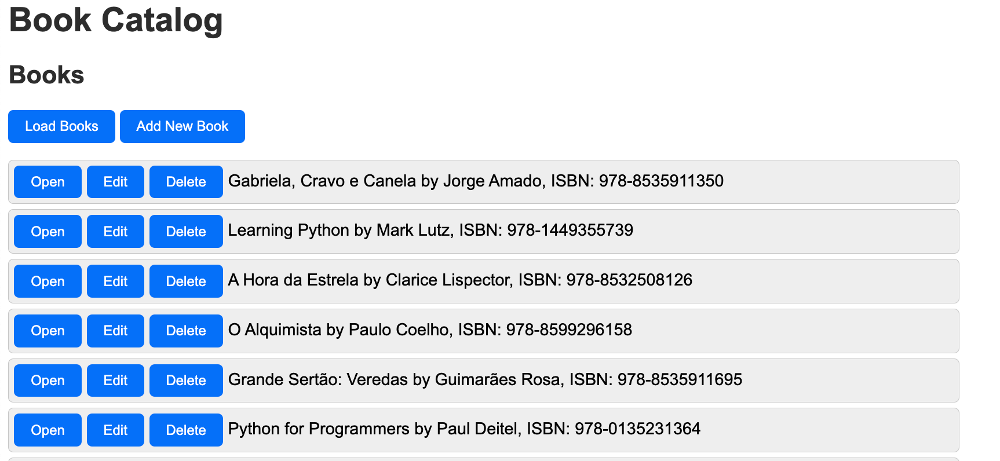
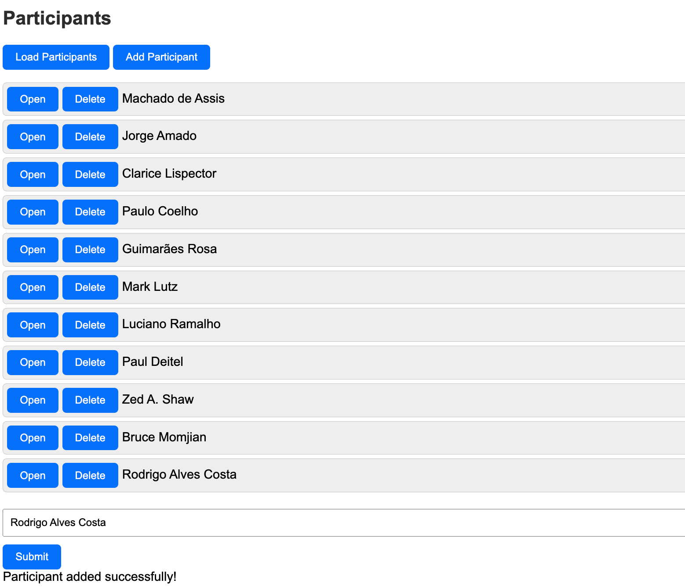
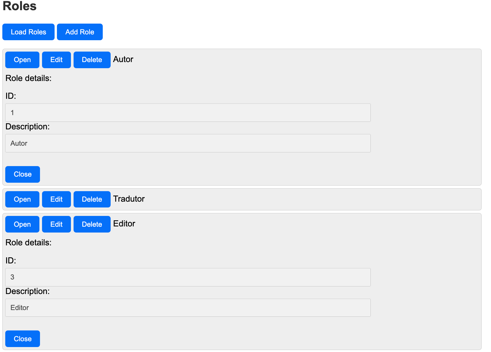
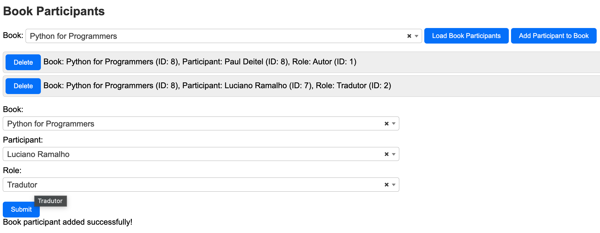

# Book Catalog UI

This is the user interface for the Book Catalog project by student [Rodrigo Alves Costa](mailto:rodrigo.costa@gmail.com) for PUC-Rio's MVP for Sprint 1, as part of the Specialization in FullStack Development course. The Book Catalog UI is a single-page application (SPA) built using Bootstrap (HTML5 + CSS + Javascript). It provides a user-friendly interface for managing books, participants, and roles in a book catalog system. Users can add, view, update, and delete books, participants, and roles through a simple web interface.

This project needs the catalog-api to be running in order to work. The catalog-api is a RESTful API that provides endpoints for managing books, participants, and roles. The Book Catalog UI interacts with this API to provide a user-friendly interface for managing the catalog. The repository for the catalog-api can be found [here](https://github.com/rodrigo-rac2/catalog-api/)

## Table of Contents

1. [Introduction](#introduction)
2. [Features](#features)
3. [Prerequisites](#prerequisites)
4. [Getting Started](#getting-started)
   - [Clone the Repository](#clone-the-repository)
   - [Install Dependencies](#install-dependencies)
   - [Environment Configuration](#environment-configuration)
   - [Running Locally](#running-locally)
   - [Running with Docker](#running-with-docker)
5. [Usage](#usage)
   - [Interacting with the UI](#interacting-with-the-ui)
   - [Searching and Filtering](#searching-and-filtering)
6. [Docker Deployment](#docker-deployment)
   - [Building the Docker Image](#building-the-docker-image)
   - [Using Docker Compose](#using-docker-compose)
7. [Contributing](#contributing)
8. [License](#license)
9. [Additional Resources](#additional-resources)
10. [Contact](#contact)
11. [Security Best Practices](#security-best-practices)
12. [Conclusion](#conclusion)

### Introduction

This project provides a web-based user interface for interacting with the Book Catalog API. It allows users to manage books, participants, and roles via a simple web interface.

### Features

#### Book Management
- **Add New Books**: Users can add new books to the catalog, specifying details such as title, ISBN, and description.
- **View Books**: Users can view a list of all books currently stored in the catalog.
- **Update and Delete**: Each book can be updated or deleted directly from the list.



#### Participant Management
- **Add New Participants**: Allows addition of participants who can be associated with books, such as authors, editors, etc.
- **View Participants**: Displays a list of all participants.
- **Update and Delete**: Participants can be updated or removed as required.



#### Role Management
- **Define Roles**: Users can define roles associated with the book publishing process, such as author, translator, and editor.
- **View Roles**: All roles can be viewed, updated, or deleted from a simple interface.



#### Book Participants
- **View Assignments**: Review all participant assignments for books within the catalog.


- **Assign Participants to Books**: Assign roles to participants for each book, for example, assigning an author or editor to a book.


- **View Updated Assignments**: After assigning participants to books, the updated assignments are displayed in the list.


#### Dynamic Configuration
- **API Integration**: The system dynamically fetches and updates its configuration from a central API, ensuring all components are always in sync.

## Prerequisites

Before you begin, ensure you have the following installed:
- Node.js (at least version 16)
- npm (usually comes with Node.js)
- Docker and Docker Compose (for containerization)

## Getting Started

### Clone the Repository

First, clone this repository to your local machine:

```bash
git clone https://github.com/rodrigo-rac2/catalog-ui/
cd catalog-ui
```

### Install Dependencies
Navigate to the project directory and install the required Node.js dependencies:

```bash
npm install
```

### Environment Configuration

Create a `.env` file in the root of your project directory. This file should contain all necessary environment configurations:

```plaintext
# local
BASE_URL=http://localhost
PORT=3000

# api
API_BASE_URL=http://127.0.0.1
API_PORT=5100

```

Adjust the variables depending on your local and API location/port.

### Running Locally

To run the application locally without Docker, you can start the server using npm:

```bash
npm start
```

This command will start the Node.js application which serves your SPA on http://localhost:3000.


### Running with Docker

To run the application in a Docker container, use Docker Compose:

```bash
docker-compose up --build
```

This command builds the Docker image if it hasn't been built and starts the container. The application will be accessible at http://localhost:3000.

## Usage

After starting the application, navigate to `http://localhost:3000` in your web browser to interact with the UI. The interface provides functionalities to interact with the Book Catalog API:

- **Load Books**: Click the "Load Books" button to retrieve and display a list of books from the API.
- **Add Book**: Use the form to submit new books to the catalog. Fill in all required fields and click "Submit" to add a new book.
- **Load Participants**: Click the "Load Participants" button to retrieve and display a list of participants.
- **Add Participant**: Use the form to submit new participants to the catalog.
- **Load Roles**: Click the "Load Roles" button to retrieve and display a list of roles.
- **Add Role**: Use the form to submit new roles to the catalog.
- **Assign Participants**: Assign participants to books by selecting a book and participant, then clicking "Assign".
- **View Assignments**: View all participant assignments for books in the catalog.

### Searching and Filtering

- **Search Books**: You can search for books by title, author, or ISBN using the search bar provided.
- **Filter Participants/Roles**: Use the provided filters to narrow down the list of participants or roles based on specific criteria.

## Docker Deployment

This project includes a `Dockerfile` and `docker-compose.yml` for easy deployment using Docker containers.

### Building the Docker Image

To build the Docker image manually:

```bash
docker build -t book-catalog-ui .
```

### Using Docker Compose

The docker-compose.yml file is set up to build the application and run it in a container. Use the following command to start the application using Docker Compose:

```bash
docker-compose up 
```

This will start the service defined in docker-compose.yml, making the application accessible at http://localhost:3000.

## Contributing

Contributions to this project are welcome! If you have suggestions or improvements, please fork the repository and submit a pull request with your changes. Here’s how you can contribute:

- **Report Bugs**: Create an issue in the GitHub repository describing the bug.
- **Suggest Enhancements**: Provide suggestions for additional features or improvements to existing functionalities.
- **Submit Pull Requests**: Implement bug fixes or new features and make a pull request.

Before contributing, please read the project's contribution guidelines and code of conduct. This ensures a harmonious and productive community environment.

## License

This project is licensed under the MIT License - see the [LICENSE](LICENSE) file for details. The MIT License is a permissive free software license that allows participants great freedom in the use and distribution of the software.

### Notes:
- Ensure that all placeholder texts such as repository URLs are replaced with actual data relevant to your project.
- Review the `docker-compose.yml` provided in previous instructions to ensure it aligns with your project setup.
- The README assumes that the user has basic knowledge of navigating Docker and Node.js environments. Additional setup or troubleshooting guides can be provided based on the target audience's expertise level.

## Additional Resources

For more detailed instructions on setting up Node.js environments, Docker, or managing microservices, refer to the following official documentation:

- [Node.js official documentation](https://nodejs.org/en/docs/)
- [Docker official documentation](https://docs.docker.com/)
- [Understanding Microservices](https://microservices.io/)

These resources provide comprehensive guides and best practices that can help you leverage the full potential of Node.js and Docker in your projects.

## Contact

For any queries or further assistance with the project setup, please reach out through the project's GitHub issue tracker. You can also contact the project maintainers directly via email provided in the GitHub profiles linked in the repository.

Thank you for your interest in contributing to the Book Catalog UI project. We look forward to your contributions and are excited to see how the project evolves with community involvement!

## Security Best Practices

When deploying and managing applications that handle sensitive information, it is crucial to adhere to best practices that protect your data and systems. Here are several recommended practices to enhance the security of your Book Catalog UI application:

### Use HTTPS
Ensure that all communications between your clients and the server are encrypted using HTTPS to prevent interception of data in transit. Obtain and configure an SSL/TLS certificate for your server.

### Environment Configuration
- **Environment Variables**: Store sensitive information such as API keys, database credentials, and configuration settings in environment variables instead of hardcoding them into your source code.
- **Secure Storage**: Use secure vaults or services specifically designed for storing sensitive configuration data.

### Data Validation and Sanitization
- **Input Validation**: Always validate inputs on both the client-side and server-side to prevent common vulnerabilities such as SQL injection and cross-site scripting (XSS).
- **Data Sanitization**: Sanitize data received from users or external systems to ensure it does not contain malicious content.

### Authentication and Authorization
- **Strong Authentication**: Implement robust authentication mechanisms like OAuth or JWT (JSON Web Tokens) to manage user identities securely.
- **Role-Based Access Control (RBAC)**: Define roles and permissions clearly to ensure that users can only access data and actions relevant to their role.

### Regular Security Audits
- **Code Reviews**: Regularly review code for security vulnerabilities and compliance with best practices.
- **Use Automated Security Scanning Tools**: Integrate automated security scanning tools in your CI/CD pipeline to catch vulnerabilities early.
- **Penetration Testing**: Conduct periodic penetration tests to uncover and address security weaknesses.

### Secure Dependencies
- **Manage Dependencies**: Regularly update all project dependencies to their latest versions to incorporate security fixes. Use tools like `npm audit` to identify and resolve security issues in dependencies.
- **Container Security**: If using Docker, ensure images are obtained from trusted sources and regularly updated.

### Logging and Monitoring
- **Monitoring**: Set up monitoring on all components of your application to detect and respond to suspicious activity quickly.
- **Audit Logs**: Maintain comprehensive logs of critical system and user activities. Ensure logs are stored securely and monitored regularly.

### Incident Response Plan
Develop an incident response plan to quickly address security breaches or data leaks. This plan should include:
- **Immediate Steps** to contain and mitigate the damage.
- **Communication Strategies** with stakeholders.
- **Post-Incident Analysis** to learn from the incident and improve security measures.

### Data Privacy
- **Compliance**: Ensure your application complies with relevant data protection regulations such as GDPR, HIPAA, or CCPA.
- **Data Minimization**: Only collect data necessary for your application’s functionality.
- **User Data Rights**: Implement mechanisms to address user rights concerning their data, such as data access, rectification, and deletion requests.

## Conclusion

By implementing these security best practices, you enhance the protection of sensitive information and improve the overall security posture of your Book Catalog UI application. Always stay updated with the latest security trends and technologies to continuously fortify your application against emerging threats.
